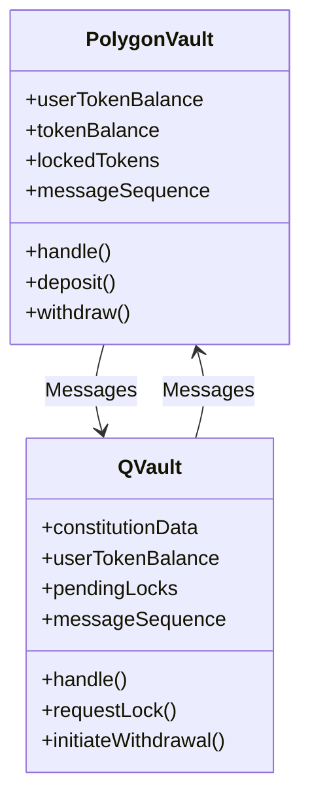

# **Smart Contract Security Audit Repository**

Welcome to my **Smart Contract Security Audit Repository**! This repository documents my journey into learning and mastering the art of auditing smart contracts. It serves as a showcase of my progress, experiments, and insights gained while exploring the security aspects of blockchain development.

---

## **About This Repository**

This repository is a collection of:
- **Audited Contracts:** Examples of contracts I’ve analyzed, with detailed breakdowns of vulnerabilities and fixes.
- **Learning Resources:** Notes and references I’ve gathered while learning about smart contract security.
- **Methodologies and Tools:** Documentation of the techniques and tools I use to analyze and secure contracts.
- **Experimentation:** Hands-on experiments with auditing tools and secure coding practices.

---

## **What This Repository Covers**

### 1. **Audit Examples**
A growing collection of audits I’ve performed on sample contracts, covering:
- Common vulnerabilities like reentrancy, integer overflows, and unchecked external calls.
- Insights into best practices for secure contract development.

### 2. **Learning Notes**
Topics I’m exploring, including:
- Security patterns in Solidity.
- Common attack vectors and their mitigations.
- Best practices for gas efficiency and secure logic.

### 3. **Tools and Techniques**
Documentation on how I use tools like:
- **[Slither](https://github.com/crytic/slither):** Static analysis for Solidity.
- **[Mythril](https://github.com/ConsenSys/mythril):** Security analysis for EVM bytecode.
- **[Foundry](https://getfoundry.sh):** Testing and fuzzing smart contracts.

## **Why I Created This Repository**

- **Learning by Doing:** Practical auditing of contracts helps solidify my understanding of blockchain security.
- **Showcasing Growth:** This repository reflects my progress as I transition from learning to advanced auditing.
- **Open Sharing:** Sharing my journey might help others who are also interested in becoming smart contract auditors.

---

## **What’s Next?**

As I continue to learn, I’ll:
- Add more audit examples.
- Explore advanced topics like formal verification and gas optimization.
- Contribute to open-source smart contract security efforts.

---

## **Get in Touch**

I’m always open to feedback, collaboration, or discussions about smart contract security. Reach out via:
- **Email:** [jaymakwanaworks@gmail.com](mailto:jaymakwanaworks@gmail.com)
- **Telegram:** [@jmakwana01](https://telegram.me/jmakwana01)

---

